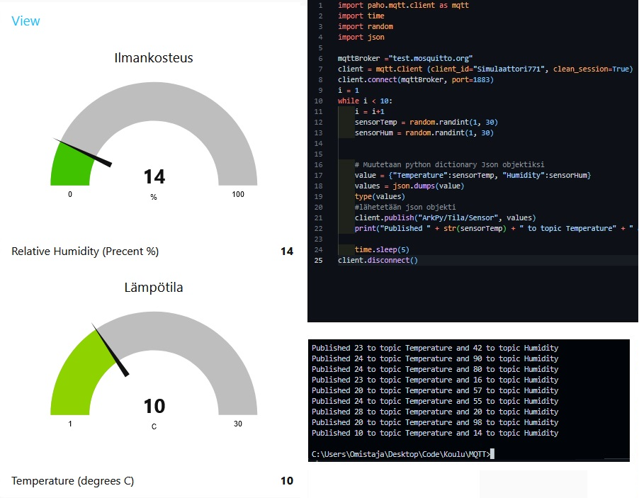

This is a public sample with Node-Red & MQTT.

You can import this flow with the .json file in node-red.

The python file has a while loop in the code to publish to MQTT broker and includes a "sensor".

